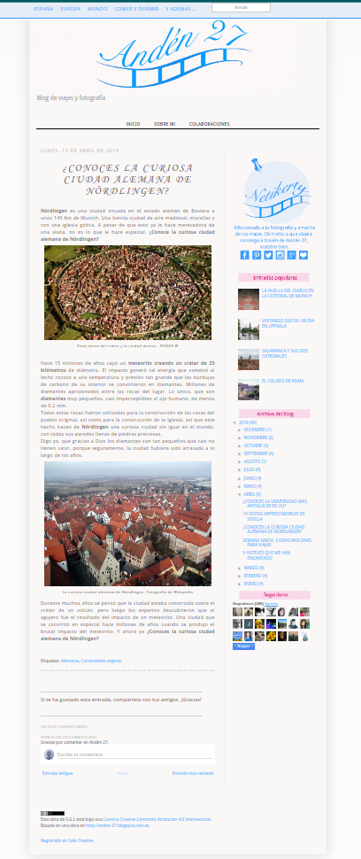

# Anden 27
## Introducción
La inmensa mayoría de blogs siguen una estructura similar: 
- una cabecera, 
- un área para el contenido, 
- uno o varios elementos de navegación, 
- un área de contenido accesorio y un pie. 

Esta estructura en HTML5 se representaría con los elementos: 
- `<header>` (cabecera), 
- `<main>` (para el contenido principal), 
- `<nav>` (para la navegación), 
- `<aside>` (para el contenido accesorio) y 
- `<footer>` (para el pie). 
Dentro del elemento `<main>` se utilizan etiquetas `<article>` para cada entrada del blog.

La estructura correspondería al [esquema siguiente](https://webdesign.tutsplus.com/html-5-and-css-3-the-techniques-youll-soon-be-using--net-5708t)

Teniendo esto en cuenta, vamos a clonar la estructura del siguiente blog:
[Anden27](http://anden-27.blogspot.com/)

## Objetivo
Clonar la siguiente página del blog Anden 27:

gif animado

 

gif animado

 

## Recursos
- las imágenes necesarias para clonar la página las encontrarás en la carpeta `assets`
- el texto de la página lo tienes en el fichero `index.html`

# Backlog 
- Aplica los estilos necesrios utilizando una hoja de estilos que tenga el nombre `style.css`
- El texto principal debe tener las siguientes características:
  - El color del texto es azul: #00F.
  - El color de fondo del texto es verde claro: #CFC.
  - El tipo de letra es la secuencia: Georgia, Cambria, serif.
  - El tamaño del texto: 16px.

- El encabezado de nivel 1 debe tener:
  - El color del texto es rojo claro: #F00.
  - El tipo de letra es la secuencia: Verdana, Calibri, sans-serif.
  - El tamaño del texto: 32px.

- El encabezado de nivel 2:
  - El color del texto es rojo claro: #A00.
  - El tipo de letra es la secuencia: Verdana, Calibri, sans-serif.
  - El tamaño del texto: 24px.
- El color de las etiquetas debe ser: #060.
- El texto "Nördlingen":
  - El color del texto es blanco: #FFF.
  - El color de fondo del texto es negro: #000.
  - Texto en cursiva.

*Consejo: puedes utilizar las etiquetas de HTML `<em>` y `<strong>`.*
*Consejo: puedes utilizar la etiqueta de HTML `` para aplicar un estilo CSS a cualquier parte del texto.*

# PARTE 3

* Sustituir el color del fondo de la página por una imagen (puedes usar la imagen "barco-1519472858uxq.jpg") con las siguientes características:
  * La imagen debe ocupar todo el viewport sin repetirse.
  * Debe permanecer fija, no debe hacer scroll con el texto
* Sobre el fondo incorporar un logo (vale cualquier imagen de pequeño tamaño):
  * Se situará en la esquina superior derecha.
  * No permanecerá fija, hará scroll con el texto.

# PARTE 4

Vamos a intentar hacer que nuestro blog se parezca al original. Para ello haremos los siguientes cambios:
* Modifica la barra de navegación para que aparezca com un elemento horizontal (inline);
* Posiciona el elemento aside al lado derecho del artículo principal de la página.

